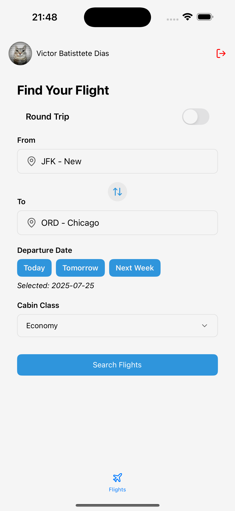
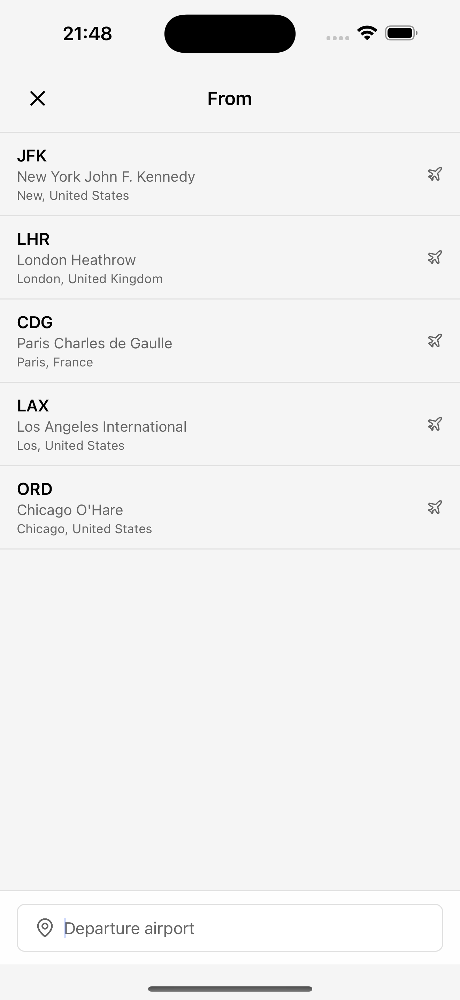
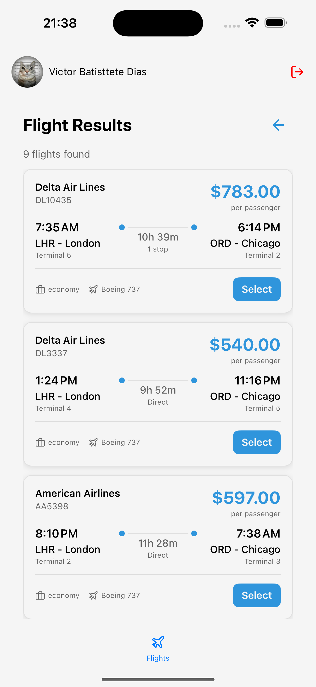

# ✈️ Flights Mobile

A modern React Native mobile application for flight booking and search, built with Expo Router.

<div align="center">
  
  
  
  
</div>

## Features

- **🔐 User Authentication** - Secure sign-in and sign-up with form validation
- **✈️ Flight Search** - Search flights with flexible date and route options
- **🏢 Airport Search** - Find airports with autocomplete functionality

## Getting Started

### Installation

1. **Clone the repository**

   ```bash
   git clone https://github.com/victorbdias/google-flights-mobile.git
   cd google-flights-mobile
   ```

2. **Install dependencies**

   ```bash
   yarn install
   ```

3. **Start the development server**

   ```bash
   yarn start
   ```

4. **Run on your device/simulator**

   ```bash
   # For iOS
   yarn ios

   # For Android
   yarn android
   ```

## 📁 Project Structure

```
src/
├── apis/                 # API integrations
│   ├── air-scrapper/    # Flight search API
│   └── auth/           # Authentication API
├── app/                 # Expo Router pages
│   ├── (auth)/         # Authentication screens
│   └── (signed)/       # Main app screens
├── components/          # Reusable components
│   ├── atoms/          # Basic UI components
│   └── molecules/      # Complex UI components
├── contexts/           # React contexts
├── design/             # Design system
├── models/             # TypeScript interfaces
├── services/           # Business logic
├── storage/            # Local storage utilities
├── translations/       # i18n configuration
├── utils/              # Utility functions
├── validations/        # Form validation schemas
└── zustand/           # State management stores
```

## Author

| [](https://github.com/victorbdias) |
| ---------------------------------------------------------------------------------------------------------------------- |
| [VictorBDias](https://github.com/victorbdias)                                                                          |

---

<div align="center">
  <p>author <a href="https://github.com/victorbdias">VictorBDias</a></p>
</div>
