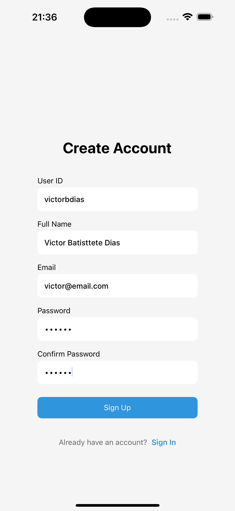

# ✈️ Google Flights Mobile

A modern React Native mobile application for flight booking and search, built with Expo Router and featuring a beautiful, intuitive user interface.

<div align="center">
  
  
  
  
</div>

## 🚀 Features

- **🔐 User Authentication** - Secure sign-in and sign-up with form validation
- **✈️ Flight Search** - Search flights with flexible date and route options
- **🏢 Airport Search** - Find airports with autocomplete functionality
- **📱 Modern UI/UX** - Beautiful, responsive design with Tamagui components
- **🌍 Internationalization** - Multi-language support (English & Portuguese)
- **📊 Real-time Results** - Live flight search with loading states
- **💾 Local Storage** - Persistent data with MMKV storage
- **🎨 Theme Support** - Light and dark theme modes
- **📱 Cross-platform** - Works on both iOS and Android

## 🛠️ Technology Stack

- **Framework**: React Native with Expo
- **Navigation**: Expo Router (file-based routing)
- **UI Library**: Tamagui
- **State Management**: Zustand
- **Form Handling**: React Hook Form + Zod validation
- **HTTP Client**: Axios
- **Storage**: MMKV (high-performance key-value storage)
- **Styling**: Unistyles + Tamagui
- **Internationalization**: i18next
- **Type Safety**: TypeScript
- **Code Quality**: ESLint + Prettier

## 📱 Screenshots

### Authentication Flow

<div align="center">
  
  <p><em>User registration with form validation</em></p>
</div>

### Main Application

<div align="center">
  
  <p><em>Main dashboard with flight search</em></p>
</div>

### Flight Search Results

<div align="center">
  
  <p><em>Flight search results with booking options</em></p>
</div>

### Airport Selection

<div align="center">
  
  <p><em>Airport search with autocomplete</em></p>
</div>

## 🚀 Getting Started

### Prerequisites

- Node.js (v18 or higher)
- Yarn or npm
- Expo CLI
- iOS Simulator (for iOS development)
- Android Studio (for Android development)

### Installation

1. **Clone the repository**

   ```bash
   git clone https://github.com/victorbdias/google-flights-mobile.git
   cd google-flights-mobile
   ```

2. **Install dependencies**

   ```bash
   yarn install
   # or
   npm install
   ```

3. **Start the development server**

   ```bash
   yarn start
   # or
   npm start
   ```

4. **Run on your device/simulator**

   ```bash
   # For iOS
   yarn ios

   # For Android
   yarn android

   # For web
   yarn web
   ```

## 📁 Project Structure

```
src/
├── apis/                 # API integrations
│   ├── air-scrapper/    # Flight search API
│   └── auth/           # Authentication API
├── app/                 # Expo Router pages
│   ├── (auth)/         # Authentication screens
│   └── (signed)/       # Main app screens
├── components/          # Reusable components
│   ├── atoms/          # Basic UI components
│   └── molecules/      # Complex UI components
├── contexts/           # React contexts
├── design/             # Design system
├── models/             # TypeScript interfaces
├── services/           # Business logic
├── storage/            # Local storage utilities
├── translations/       # i18n configuration
├── utils/              # Utility functions
├── validations/        # Form validation schemas
└── zustand/           # State management stores
```

## 🔧 Available Scripts

- `yarn start` - Start the Expo development server
- `yarn android` - Run on Android device/emulator
- `yarn ios` - Run on iOS device/simulator
- `yarn web` - Run on web browser
- `yarn lint` - Run ESLint
- `yarn cleanup` - Clean node_modules
- `yarn nuke` - Complete project reset (iOS + Android)

## 🎨 Design System

The app uses a comprehensive design system with:

- **Colors**: Consistent color palette with light/dark themes
- **Typography**: Scalable text components
- **Spacing**: Standardized spacing system
- **Components**: Atomic design pattern with reusable components
- **Icons**: Lucide icons for consistency

## 🌍 Internationalization

The app supports multiple languages:

- English (en)
- Portuguese (pt)

Translation files are located in `src/translations/languages/`.

## 📱 Platform Support

- ✅ iOS 13+
- ✅ Android 8+
- ✅ Web (experimental)

## 🤝 Contributing

1. Fork the repository
2. Create your feature branch (`git checkout -b feature/amazing-feature`)
3. Commit your changes (`git commit -m 'Add some amazing feature'`)
4. Push to the branch (`git push origin feature/amazing-feature`)
5. Open a Pull Request

## 📄 License

This project is licensed under the MIT License - see the [LICENSE](LICENSE) file for details.

## 👨‍💻 Author

| [](https://github.com/victorbdias) |
| ---------------------------------------------------------------------------------------------------------------------- |
| [VictorBDias](https://github.com/victorbdias)                                                                          |

---

<div align="center">
  <p>author <a href="https://github.com/victorbdias">VictorBDias</a></p>
</div>
